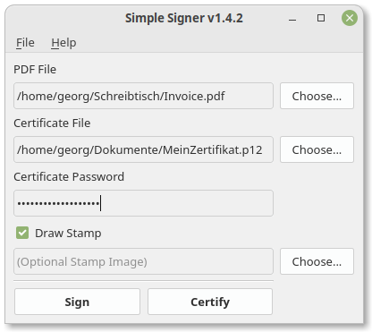

# Simple Signer
Simple Signer allows you to sign PDF files using a simple GUI.



## But why?
On current Ubuntu versions, it is not possible to import personal certificates into the certificate management application called "Seahorse" (see [here](https://gitlab.gnome.org/GNOME/seahorse/-/issues/232)). This prevents LibreOffice from signing PDF documents. That's why I created this workaround.

As additional features, Simple Signer allows you to certify documents (which, in contrast to signing, locks the document so no further signature is allowed) and draw stamps corresponding to your signature as known from the Adobe Reader.

## Installation
### Debian Package
You can download and install the `.deb` package from the [latest release](https://github.com/schorschii/Simple-Signer/releases) on GitHub.

### Manual Installation
```
apt install python3-pip python3-pyqt5 python3-venv swig
python3 -m venv simple-signer                       # create a new venv dir
simple-signer/bin/pip3 install -r requirements.txt  # install requirements in venv
simple-signer/bin/pip3 install .                    # install simple-signer in venv

simple-signer/bin/python3 -m simple_signer          # start manually

cp assets/simple-signer.desktop /usr/local/share/applications
sudo update-desktop-database
```

## Usage
- Start the script and choose PDF and cert file using the buttons in the GUI.

or

- Right-click on a PDF file in your file manager -> "Open With" -> "Simple Signer".

then

- Enter the path to your certificate file and your certificate's passphrase, then click:
  - **Sign**: allows multiple users to place their signature
  - **Certify**: places your signature and locks the document - after that, no further signature can be added
  - **Draw Stamp**: you can optionally place a visual stamp on the document which is linked to your signature

## Stamp Manifest File
Simple Signer allows to load a stamp configuration file (extension `.stampinfo` with JSON content), which contains the position and size of the stamp to draw. This feature is intended for visually impaired people who cannot draw the stamp rect themselves. Another person can create this stamp configuration file in advance, so they can sign documents of a certain type with without further help. The resulting stamp config is shown on the command line when drawing the stamp rect manually. This config can then simply be copied into a `.stampinfo` file for further use.

Example `.stampinfo` file:
```
{"rect":[216.84396666666666, 273.77105369127514, 319.76990476190474, 312.738466442953], "page":0}
```

## Advanced Usage / Signature Customization
You can add the following (additional) settings to the config file `~/.config/Simple-Signer/settings.ini`:
```
[settings]
cert-path = /path/to/my/cert.p12
stamp-path = 
draw-stamp = 1

signature-contact = Schorschii
signature-location = Sieber Systems HQ
signature-reason = Weil's geht!
stamp-background = 255,255,255
stamp-outline = 255,0,0
stamp-border = 2
stamp-labels = CN,DN,date,contact,reason,location
```

## Development
### I18n
```
# 1. create translation files from code
pylupdate5 simple-signer.py -ts lang/de.ts

# 2. use Qt Linguist to translate the file

# 3.a. compile translation files for usage
lrelease lang/*.ts
# 3.b. or use make to compile all
make
```

### Compiling (on Windows)
```
pyinstaller.exe -F --noconsole simple-signer.py --add-data="lang/de.qm;lang" --add-data="C:\Users\vm2\AppData\Roaming\Python\Python38\site-packages\endesive\pdf\PyPDF2_annotate\fonts\Helvetica.ttf;endesive/pdf/PyPDF2_annotate/fonts"
```
